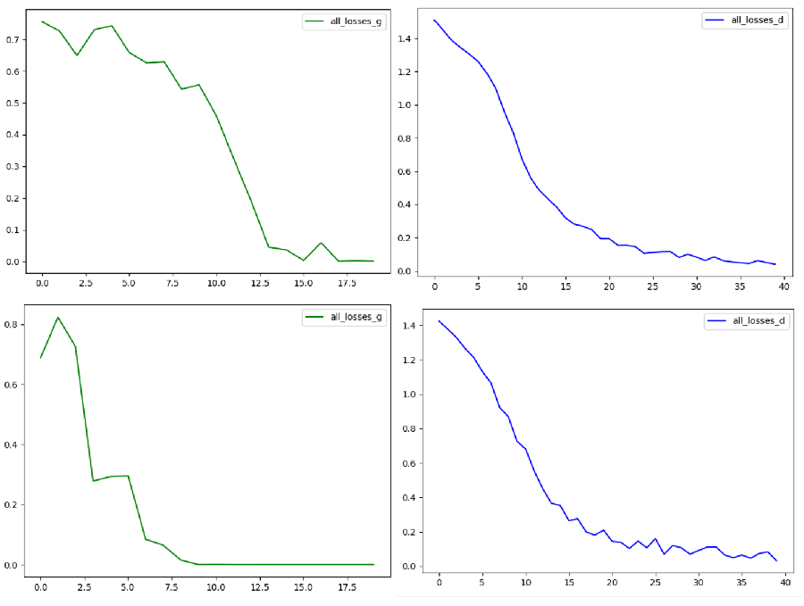
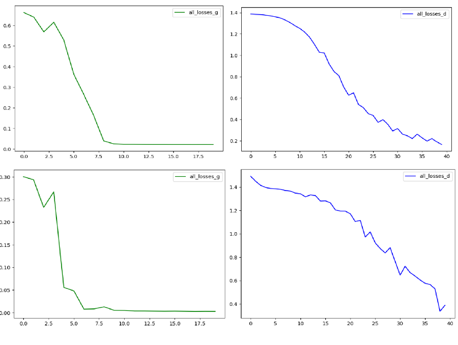
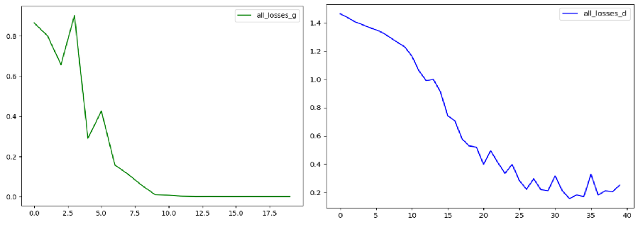
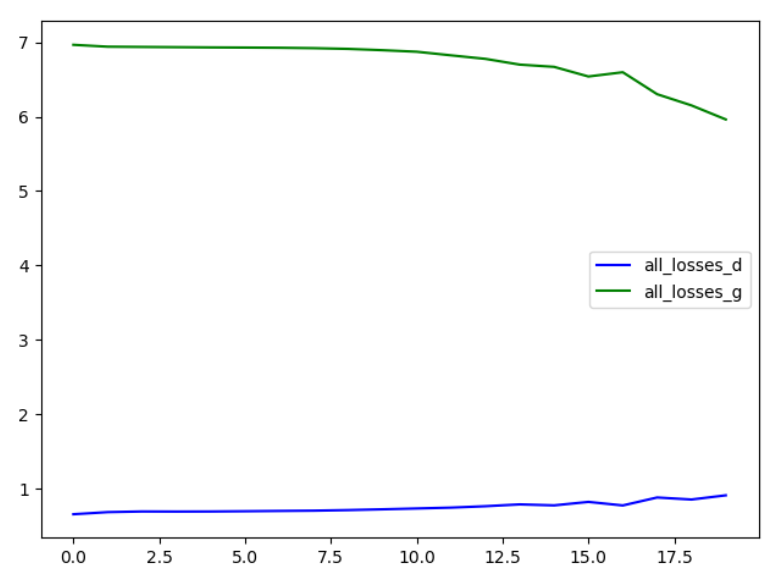
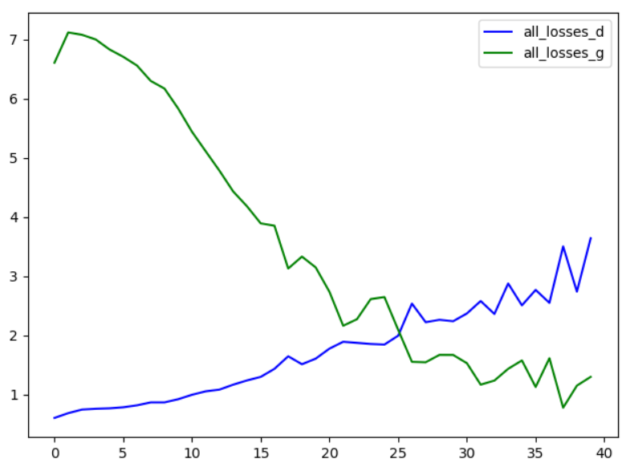

  **Графики преобразования на базисных фунцкциях:**
  
  
  
  
  
  
  
  
  
  
  
  
  **График преобразования генератором шума до обучения (размерности 8):**
  
  
  
  Одному генератору изначально присваиваются весы [[1., 0.5], [1., 0.5]]. С этими весами генерируентся датасет, элементы которого будут считаться реальными данными. Напротив,  есть второй генератор со случайными весами, который генерирует фейковые данные. Для обучения дискриминатора мы последний фиксируем.
Значения его весов (из вывода программы): 

random weights for gen:  tensor([[-0.3687,  0.9540],
        [ 0.1350,  0.6512]], dtype=torch.float64, requires_grad=True)

 Дискриминатор тренируется отличать наборы из реального датасета от генерируемых фейковых. Тк генератор мы зафиксировали, за 10 эпох дискриминатор переобучился - выучив реальные данные, он с вероятностью, близкою к 1, отличает их от генерируемых.
 
 **Cходимость дискриминатора (генератор фиксирован):**
 Вывод:
* 0m 1s (0 45%) 1.4232714926
* 0m 1s (0 95%) 1.3812576477
* 0m 3s (1 45%) 1.3365561617
* 0m 3s (1 95%) 1.2870264919
* 0m 5s (2 45%) 1.1664085890
* 0m 5s (2 95%) 1.0646780299
* 0m 7s (3 45%) 0.9308961051
* 0m 8s (3 95%) 0.7834851407
* 0m 9s (4 45%) 0.6429810250
* 0m 10s (4 95%) 0.5829680309
* 0m 12s (5 45%) 0.6410236607
* 0m 12s (5 95%) 0.2871743001
* 0m 14s (6 45%) 0.2091791714
* 0m 14s (6 95%) 0.1663605517
* 0m 16s (7 45%) 0.3531387902
* 0m 16s (7 95%) 0.1933442019
* 0m 18s (8 45%) 0.0888133623
* 0m 18s (8 95%) 0.3500031084
* 0m 20s (9 45%) 0.2726531624
* 0m 20s (9 95%) 0.0622866342

* chance of real data to be taken as real:  tensor([[0.9747],
*         [0.8599],
*         [0.9775],
*         [0.1470],
*         [0.2869]], dtype=torch.float64, grad_fn=<SigmoidBackward>)
 
* chance of fake data to be taken as real (before training gen):  tensor([[0.0075],
*         [0.0282],
*         [0.0019],
*         [0.1778],
*         [0.0053]], dtype=torch.float64, grad_fn=<SigmoidBackward>)
 
Переобучив генератор, мы хотим (немного) натренировать генератор так, чтобы дискриминатор с равной вероятностью принимал реальные и фейковаые наборы за реальные (те Dis(x~real/x~fake)=1/2). Но натренировать его надо именно немного, чтобы не допустить переобучение и его : он может идеально приблизить свое распределение к реальному, так что дискриминатор будет принимать его за реальные.

**Сходимость генератора:**
* 0m 22s (0 0%) 4.3284102786
* 0m 22s (0 5%) 4.0050857793
* 0m 22s (0 10%) 3.2875973580
* 0m 22s (0 15%) 4.5108530570
* 0m 22s (0 20%) 1.4521777599
* 0m 22s (0 25%) 2.1330746263
* 0m 22s (0 30%) 0.7938431003
* 0m 22s (0 35%) 0.5552687359
* 0m 22s (0 40%) 0.2860485917
* 0m 22s (0 45%) 0.0497224105
* 0m 22s (0 50%) 0.0370258817
* 0m 22s (0 55%) 0.0140218689
* 0m 22s (0 60%) 0.0043063720
* 0m 22s (0 65%) 0.0048854674
* 0m 22s (0 70%) 0.0042749155
* 0m 22s (0 75%) 0.0040482116
* 0m 22s (0 80%) 0.0043482904
* 0m 22s (0 85%) 0.0039892155
* 0m 22s (0 90%) 0.0039880660
* 0m 22s (0 95%) 0.0039884354

trained generator's weights:  tensor([[1.4706, 2.5319],
        [1.6647, 2.0589]], dtype=torch.float64, grad_fn=<SubBackward0>)
* chance of fake data to be taken as real(after training gen):  tensor([[0.9960],
*         [0.9960],
*         [0.9960],
*         [0.9960],
*         [0.9960]], dtype=torch.float64, grad_fn=<SigmoidBackward>)

**Графики сходимости:**
на разных запусках

Создаем 2 новых экземпляра сетей. Обновляем весы и дискриминатора, и генератора единовременно. На 1 обновление генератора приходится 5 обновлений дискриминатора. Обучение в 5 эпох.
**Параллельное обучение:**
* 0m 1s (0 25%) 1.3875201854   0.666691
* 0m 2s (0 50%) 1.3875181825   0.691416
* 0m 3s (0 75%) 1.3868885533   0.692798
* 0m 3s (0 100%) 1.3866329631   0.691622
* 0m 5s (1 25%) 1.3860614869   0.694279
* 0m 6s (1 50%) 1.3854948420   0.697713
* 0m 7s (1 100%) 1.3823778188   0.705802
* 0m 9s (2 25%) 1.3801654393   0.714848
* 0m 10s (2 50%) 1.3795267505   0.728730
* 0m 10s (2 75%) 1.3754522782   0.736504
* 0m 11s (2 100%) 1.3614954236   0.761327
* 0m 13s (3 25%) 1.3404371124   0.770364
* 0m 14s (3 50%) 1.3320967477   0.785306
* 0m 14s (3 75%) 1.3212427026   0.792728
* 0m 15s (3 100%) 1.3137825792   0.818988
* 0m 17s (4 25%) 1.3046378773   0.797950
* 0m 17s (4 50%) 1.3225270815   0.868985
* 0m 18s (4 75%) 1.2078141270   0.860750
* 0m 18s (4 100%) 1.2061101590   0.882078

**Тестирование обученных параллельно:**
Обученному дискриминатору подаются реальные данные (датасет, нагенерированный в начале на фиксированном "умном" генераторе)
 и фейковые(сгенерированные только что обученным генератором). Предполается, что дискриминатор должен на обе выборки выдавать вероятность около 1/2.
Вывод:
* chance that fake is taken for real:  tensor([[0.4139],
*         [0.4139],
*         [0.4139],
*         [0.4139],
*         [0.4139]], dtype=torch.float64, grad_fn=<SigmoidBackward>)
* chance that real is taken for real:  tensor([[0.7126],
*         [0.6722],
*         [0.5545],
*         [0.6777],
*         [0.6181]], dtype=torch.float64, grad_fn=<SigmoidBackward>)
* chance that fake is taken for real:  tensor([[0.4139],
*         [0.4139],
*         [0.4139],
*         [0.4139],
*         [0.4139]], dtype=torch.float64, grad_fn=<SigmoidBackward>)
* chance that real is taken for real:  tensor([[0.7126],
*         [0.6722],
*         [0.5545],
*         [0.6777],
*         [0.6181]], dtype=torch.float64, grad_fn=<SigmoidBackward>)
* chance that fake is taken for real:  tensor([[0.4139],
*         [0.4139],
*         [0.4139],
*         [0.4139],
*         [0.4139]], dtype=torch.float64, grad_fn=<SigmoidBackward>)
* chance that real is taken for real:  tensor([[0.7126],
*         [0.6722],
*         [0.5545],
*         [0.6777],
*         [0.6181]], dtype=torch.float64, grad_fn=<SigmoidBackward>)
* chance that fake is taken for real:  tensor([[0.4139],
*         [0.4139],
*         [0.4139],
*         [0.4139],
*         [0.4139]], dtype=torch.float64, grad_fn=<SigmoidBackward>)
* chance that real is taken for real:  tensor([[0.7126],
*         [0.6722],
*         [0.5545],
*         [0.6777],
*         [0.6181]], dtype=torch.float64, grad_fn=<SigmoidBackward>)
* chance that fake is taken for real:  tensor([[0.4139],
*         [0.4139],
*         [0.4139],
*         [0.4139],
*         [0.4139]], dtype=torch.float64, grad_fn=<SigmoidBackward>)
* chance that real is taken for real:  tensor([[0.7126],
*         [0.6722],
*         [0.5545],
*         [0.6777],
*         [0.6181]], dtype=torch.float64, grad_fn=<SigmoidBackward>)
* chance that fake is taken for real:  tensor([[0.4139],
*         [0.4139],
*         [0.4139],
*         [0.4139],
*         [0.4139]], dtype=torch.float64, grad_fn=<SigmoidBackward>)
* chance that real is taken for real:  tensor([[0.7126],
*         [0.6722],
*         [0.5545],
*         [0.6777],
*         [0.6181]], dtype=torch.float64, grad_fn=<SigmoidBackward>)
* chance that fake is taken for real:  tensor([[0.4139],
*         [0.4139],
*         [0.4139],
*         [0.4139],
*         [0.4139]], dtype=torch.float64, grad_fn=<SigmoidBackward>)
* chance that real is taken for real:  tensor([[0.7126],
*         [0.6722],
*         [0.5545],
*         [0.6777],
*         [0.6181]], dtype=torch.float64, grad_fn=<SigmoidBackward>)
* chance that fake is taken for real:  tensor([[0.4139],
*         [0.4139],
*         [0.4139],
*         [0.4139],
*         [0.4139]], dtype=torch.float64, grad_fn=<SigmoidBackward>)
* chance that real is taken for real:  tensor([[0.7126],
*         [0.6722],
*         [0.5545],
*         [0.6777],
*         [0.6181]], dtype=torch.float64, grad_fn=<SigmoidBackward>)
* chance that fake is taken for real:  tensor([[0.4139],
*         [0.4139],
*         [0.4139],
*         [0.4139],
*         [0.4139]], dtype=torch.float64, grad_fn=<SigmoidBackward>)
* chance that real is taken for real:  tensor([[0.7126],
*         [0.6722],
*         [0.5545],
*         [0.6777],
*         [0.6181]], dtype=torch.float64, grad_fn=<SigmoidBackward>)
* chance that fake is taken for real:  tensor([[0.4139],
*         [0.4139],
*         [0.4139],
*         [0.4139],
*         [0.4139]], dtype=torch.float64, grad_fn=<SigmoidBackward>)
* chance that real is taken for real:  tensor([[0.7126],
*         [0.6722],
*         [0.5545],
*         [0.6777],
*       [0.6181]], dtype=torch.float64, grad_fn=<SigmoidBackward>)

**График сходимости**

Но так красиво не всегда (почти никогда). На 10 эпохах (иногда и на 5) картина другая:

