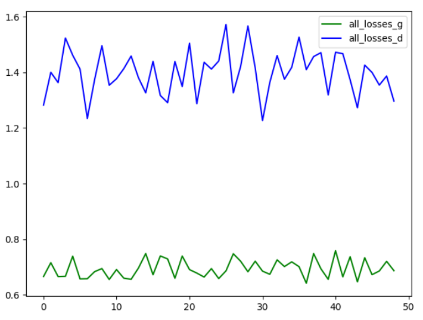

**что сделано:**
  * генератор и дискриминатор
  * датасет - нормализованные реальные данные 
  * графики:
  > 1) нулевое приближение (те первоначальльно WN -> WN)
  > 2) графики сходимости функции ошибки
  
  **График преобразования генератором шума до обучения (размерности 8):**
  
  
  
  **размерности 16:**
  
  
  
  **размерности 32:**
  
  
  
 **Cходимость:**
* 0m 5s (1 0%) 1.4005065910   0.715269
* 0m 12s (1 10%) 1.2344241195   0.657551
* 0m 19s (1 20%) 1.4136236246   0.659505
* 0m 28s (1 30%) 1.3170779258   0.739564
* 0m 37s (1 40%) 1.2876487148   0.677927
* 0m 44s (1 51%) 1.3265424797   0.747485
* 0m 52s (1 61%) 1.3641259486   0.673508
* 0m 59s (1 71%) 1.4100015361   0.641364
* 1m 9s (1 81%) 1.4673435572   0.664338
* 1m 17s (1 91%) 1.3544296776   0.685490

**График сходимости:**

**что надо сделать:**
* нагенерировать датасет генератором и прогнать на нем
* отдельную сеть-дискриминатор
* по графикам:
> 1) несколько графиков, во что преобразовался белый шум (вход генератора vs выход) 
     на разных выборках - после обучения
> 2) базисные функции
> 3) по реальным данным (приращение) 
