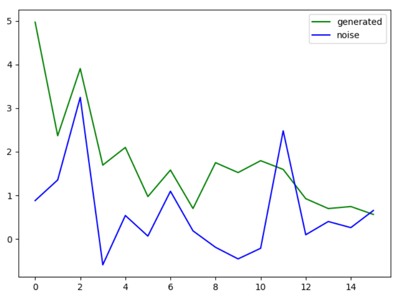
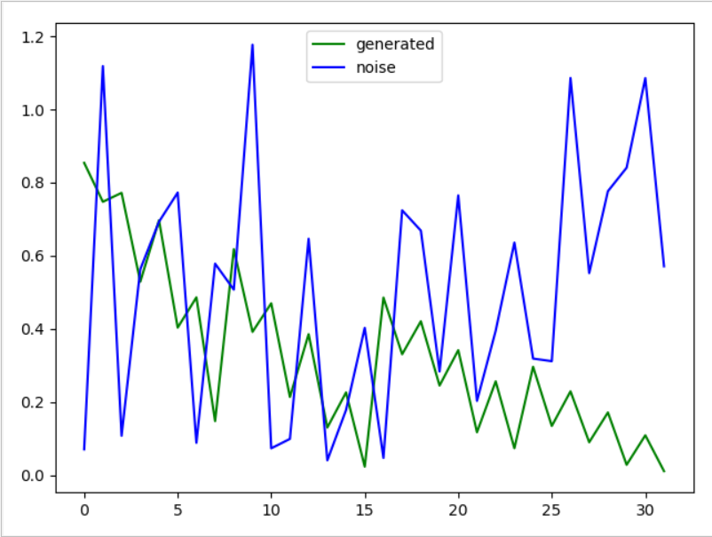
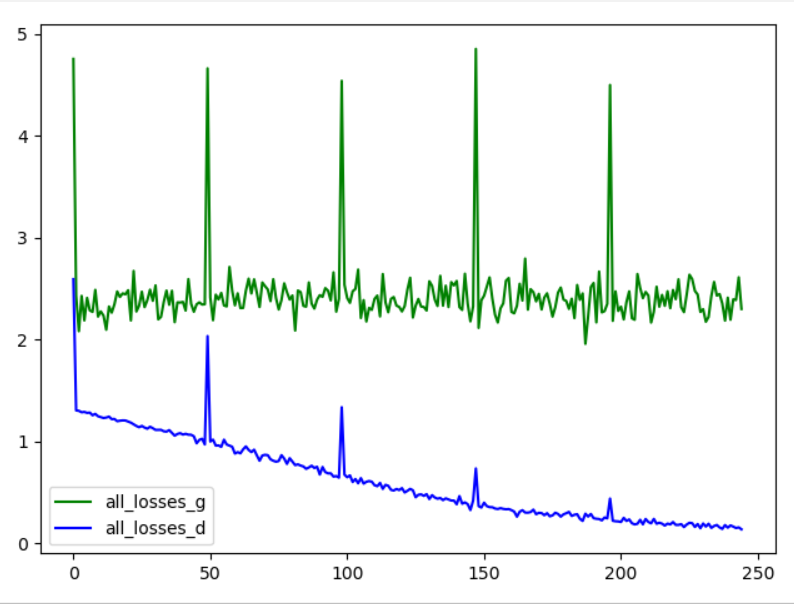

**что сделано:**
  * генератор и дискриминатор
  * датасет - нормализованные реальные данные 
  * графики:
  > 1) нулевое приближение (те первоначальльно WN -> WN)
  > 2) графики сходимости функции ошибки
  > 3) базисные функции
  
  **Графики преобразования на базисных фунцкциях:**
  
  
  
  
  
  
  
  
  
  
  
  
  **График преобразования генератором шума до обучения (размерности 8):**
  
  
  
  **размерности 16:**
  
  
  
  **размерности 32:**
  
  
  
 **Cходимость дискриминатора (генератор фиксирован):**
* 0m 1s (0 0%) 1.4066362034
* 0m 1s (0 1%) 1.3715218234
* 0m 2s (0 2%) 1.3324737008
* 0m 2s (0 3%) 1.3057526152
* 0m 3s (0 4%) 1.2729700149
* 0m 5s (1 0%) 1.2336906180
* 0m 5s (1 1%) 1.1960789211
* 0m 6s (1 2%) 1.1394960463
* 0m 7s (1 3%) 1.0851563394
* 0m 7s (1 4%) 1.0585027728
* 0m 10s (2 0%) 0.9990607524
* 0m 10s (2 1%) 0.9040284069
* 0m 11s (2 2%) 0.7754140764
* 0m 11s (2 3%) 0.6691512148
* 0m 12s (2 4%) 0.6744103202
* 0m 15s (3 0%) 0.5759645410
* 0m 15s (3 1%) 0.5744385272
* 0m 15s (3 2%) 0.4820258558
* 0m 16s (3 3%) 0.4272464147
* 0m 17s (3 4%) 0.3798923203
* 0m 19s (4 0%) 0.3951824049
* 0m 20s (4 1%) 0.2835934598
* 0m 21s (4 2%) 0.2971530056
* 0m 21s (4 3%) 0.2738927259
* 0m 22s (4 4%) 0.2456155793

**Сходимость генератора, дискриминатор фиксирован (ее нет)**
* 0m 24s (0 0%) 0.7500369982
* 0m 24s (0 20%) 0.7506857304
* 0m 25s (0 40%) 0.7490748117
* 0m 25s (0 60%) 0.7489447556
* 0m 26s (0 80%) 0.7512364257
* 0m 28s (1 0%) 0.7548927720
* 0m 28s (1 20%) 0.7490426256
* 0m 29s (1 40%) 0.7480903938
* 0m 29s (1 60%) 0.7543446616
* 0m 30s (1 80%) 0.7396474401
* 0m 32s (2 0%) 0.7475084968

**График сходимости:**

**что надо сделать:**
СХОДИМОСТЬ ГЕНЕРАТОРА
* нагенерировать датасет генератором и прогнать на нем [done]
* отдельную сеть-дискриминатор
* по графикам:
> 1) несколько графиков, во что преобразовался белый шум (вход генератора vs выход) 
     на разных выборках - после обучения
> 3) по реальным данным (приращение) 

