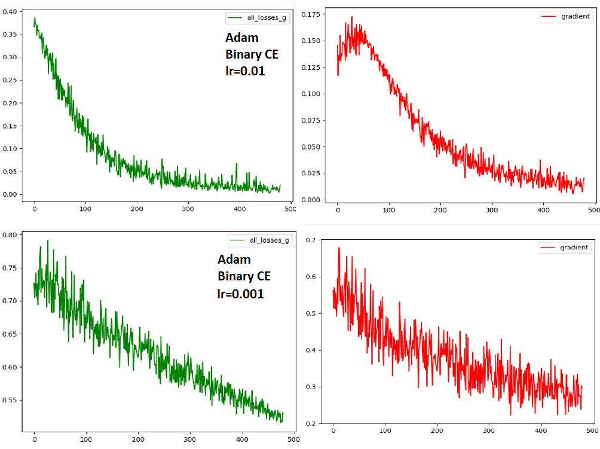
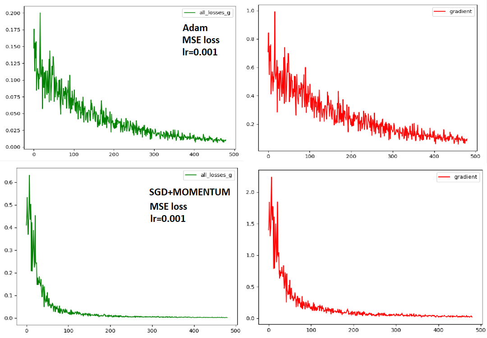
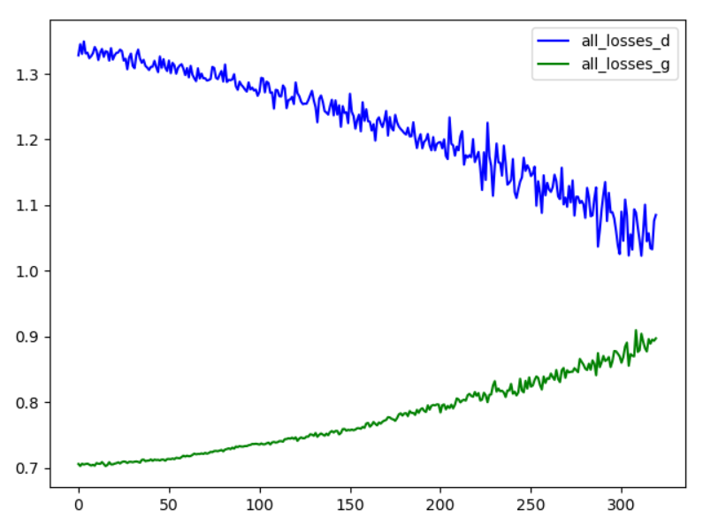
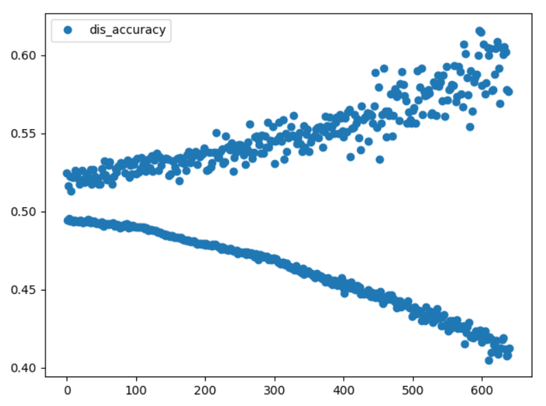

  **Графики преобразования на базисных фунцкциях:**
  
  
  
  
  
  
  
  
  
  
  
  
  **График преобразования генератором шума до обучения (размерности 8):**
  
  
  
 
 **Cходимость дискриминатора (генератор фиксирован):**
 Вывод:
* 0m 1s (0 45%) 1.3860585106
* 0m 2s (0 95%) 1.2752637272
* 0m 4s (1 45%) 1.2533146035
* 0m 4s (1 95%) 1.1387831208
* 0m 6s (2 45%) 1.0080166229
* 0m 6s (2 95%) 0.7262603302
* 0m 8s (3 45%) 0.5963395864
* 0m 9s (3 95%) 0.6801686285
* 0m 11s (4 45%) 0.3549261705
* 0m 11s (4 95%) 0.2575973772
* 0m 14s (5 45%) 0.2613432416
* 0m 14s (5 95%) 0.4485146386
* 0m 16s (6 45%) 0.2225984450
* 0m 16s (6 95%) 0.2104366320
* 0m 18s (7 45%) 0.1280114772
* 0m 18s (7 95%) 0.1763690174
* 0m 21s (8 45%) 0.1013842207
* 0m 21s (8 95%) 0.0759565001
* 0m 24s (9 45%) 0.1052490930
* 0m 24s (9 95%) 0.6381235720

* chance of real data to be taken as real:  tensor([[0.4890],
*         [0.9972],
*         [0.9753],
*         [0.9960],
*         [0.9660]], dtype=torch.float64, grad_fn=<SigmoidBackward>)

* chance of fake data to be taken as real (before training gen):  tensor([[0.0411],
*        [0.0446],
*         [0.0391],
*         [0.0696],
*         [0.0382]], dtype=torch.float64, grad_fn=<SigmoidBackward>)

**Сходимости генератора:**
**ВЕСЫ, КОТОРЫЕ НАДО ВОССТАНОВИТЬ:**
**[[0.7, 0.9], [0.1, 0.6]]**
**для случая: Adam, lr = 0.01, MSE loss:**
* random weights for gen:  tensor([[0.8771, 0.1738],
*         [0.5108, 0.5621]], requires_grad=True)
* 0m 2s (0 56%) 0.0788908037
* 0m 4s (1 56%) 0.0321953039
* 0m 7s (2 56%) 0.0284784260
* 0m 9s (3 56%) 0.0147146747
* 0m 12s (4 56%) 0.0049438275
* 0m 14s (5 56%) 0.0081030276
* 0m 17s (6 56%) 0.0079578427
* 0m 19s (7 56%) 0.0088452598
* 0m 22s (8 56%) 0.0023782629
* 0m 24s (9 56%) 0.0054411738
* 0m 27s (10 56%) 0.0019426572
* 0m 30s (11 56%) 0.0029190666
* 0m 32s (12 56%) 0.0008473068
* 0m 34s (13 56%) 0.0003438882
* 0m 37s (14 56%) 0.0007294089
* 0m 39s (15 56%) 0.0004308464
* 0m 41s (16 56%) 0.0002648795
* 0m 44s (17 56%) 0.0001056694
* 0m 46s (18 56%) 0.0000713566
* 0m 49s (19 56%) 0.0000421101
* 0m 51s (20 56%) 0.0000278724
* 0m 53s (21 56%) 0.0000100939
* 0m 56s (22 56%) 0.0000138312
* 0m 58s (23 56%) 0.0000050665
* 1m 1s (24 56%) 0.0000018177
* 1m 4s (25 56%) 0.0000006857
* 1m 7s (26 56%) 0.0000002860
* 1m 9s (27 56%) 0.0000000646
* 1m 12s (28 56%) 0.0000000857
* 1m 15s (29 56%) 0.0000000759
* trained generator's weights:  tensor([[0.7004, 0.8996],
*         [0.1000, 0.6000]], requires_grad=True)       
* Веса восстанавливаются !
* PS надо подправить проценты. Ну сколько можно?

**Графики сходимости:**
с разными параметрами

**Параллельное обучение:**
random weights for gen:  tensor([[0.9669, 0.4999],
        [0.0096, 0.3977]], requires_grad=True)
* 0m 2s (0 62%) 1.3407999596   0.703603
* 0m 5s (1 62%) 1.3202183618   0.709981
* 0m 8s (2 62%) 1.3108533646   0.711036
* 0m 10s (3 62%) 1.3146148613   0.716764
* 0m 14s (4 62%) 1.2920867636   0.724642
* 0m 17s (5 62%) 1.2880394019   0.733401
* 0m 19s (6 62%) 1.2859553493   0.738717
* 0m 22s (7 62%) 1.2704857099   0.741381
* 0m 25s (8 62%) 1.2409441506   0.752382
* 0m 28s (9 62%) 1.2164688793   0.758589
* 0m 30s (10 62%) 1.2288994266   0.772260
* 0m 33s (11 62%) 1.2262429270   0.783936
* 0m 35s (12 62%) 1.1866497233   0.795722
* 0m 38s (13 62%) 1.1730655622   0.809766
* 0m 40s (14 62%) 1.1645137661   0.816831
* 0m 43s (15 62%) 1.1550355853   0.838048
* 0m 45s (16 62%) 1.1133758882   0.835583
* 0m 48s (17 62%) 1.1264022181   0.849204
* 0m 50s (18 62%) 1.0610154001   0.877656
* 0m 53s (19 62%) 1.1008077783   0.882391
* trained generator's weights:  tensor([[0.8462, 0.2640],
        [0.8440, 0.2037]], requires_grad=True)

**График сходимости**

* график точности дискриминатора в процессе обучения (результат вывода дискриминатора на реальном примере и сгенерированном). 
* Предполагается, что поначалу разброс должен быть большим, но в процессе обучения должно сходиться к 1/2. ! А по факту сейчас
* наоборот в течение времени расходится !

