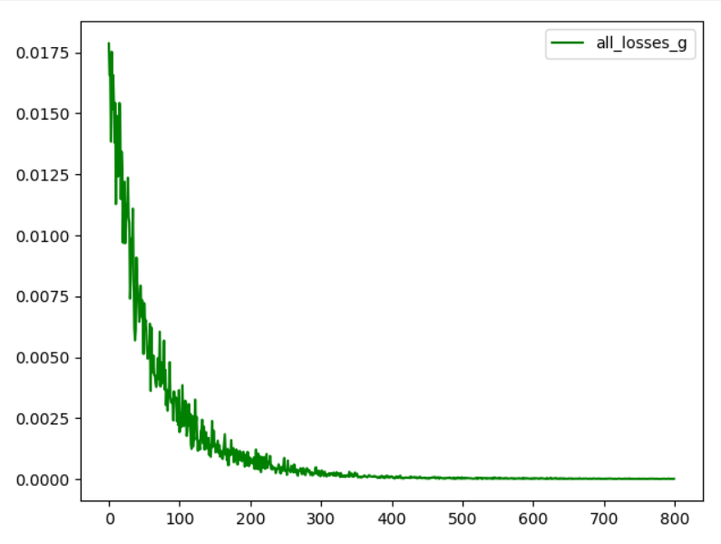

  **Графики преобразования на базисных фунцкциях:**
  
  
  
  
  
  
  
  
  
  
  
  
  **График преобразования генератором шума до обучения (размерности 8):**
  
  
  
 
 **Cходимость дискриминатора (генератор фиксирован):**
 Вывод:
* 0m 1s (0 45%) 1.3860585106
* 0m 2s (0 95%) 1.2752637272
* 0m 4s (1 45%) 1.2533146035
* 0m 4s (1 95%) 1.1387831208
* 0m 6s (2 45%) 1.0080166229
* 0m 6s (2 95%) 0.7262603302
* 0m 8s (3 45%) 0.5963395864
* 0m 9s (3 95%) 0.6801686285
* 0m 11s (4 45%) 0.3549261705
* 0m 11s (4 95%) 0.2575973772
* 0m 14s (5 45%) 0.2613432416
* 0m 14s (5 95%) 0.4485146386
* 0m 16s (6 45%) 0.2225984450
* 0m 16s (6 95%) 0.2104366320
* 0m 18s (7 45%) 0.1280114772
* 0m 18s (7 95%) 0.1763690174
* 0m 21s (8 45%) 0.1013842207
* 0m 21s (8 95%) 0.0759565001
* 0m 24s (9 45%) 0.1052490930
* 0m 24s (9 95%) 0.6381235720

* chance of real data to be taken as real:  tensor([[0.4890],
*         [0.9972],
*         [0.9753],
*         [0.9960],
*         [0.9660]], dtype=torch.float64, grad_fn=<SigmoidBackward>)

* chance of fake data to be taken as real (before training gen):  tensor([[0.0411],
*        [0.0446],
*         [0.0391],
*         [0.0696],
*         [0.0382]], dtype=torch.float64, grad_fn=<SigmoidBackward>)

**Сходимости генератора:**
**ВЕСЫ, КОТОРЫЕ НАДО ВОССТАНОВИТЬ:**
**[[0.7, 0.9], [0.1, 0.6]]**
**для случая: Adam, lr = 0.01, MSE loss:**
random generator's weights:  tensor([[0.4486, 0.3011],
        [0.5370, 0.7040]], requires_grad=True)
* 0m 2s (0 56%) 0.0154224870
* 0m 6s (1 56%) 0.0110635244
* 0m 9s (2 56%) 0.0078415594
* 0m 11s (3 56%) 0.0050585328
* 0m 14s (4 56%) 0.0037963286
* 0m 17s (5 56%) 0.0032420520
* 0m 20s (6 56%) 0.0024717097
* 0m 22s (7 56%) 0.0016101479
* 0m 25s (8 56%) 0.0019317505
* 0m 28s (9 56%) 0.0013948662
* 0m 30s (10 56%) 0.0005598741
* 0m 33s (11 56%) 0.0011541817
* 0m 36s (12 56%) 0.0008308046
* 0m 39s (13 56%) 0.0009026022
* 0m 41s (14 56%) 0.0004461783
* 0m 45s (15 56%) 0.0003485706
* 0m 48s (16 56%) 0.0002562926
* 0m 51s (17 56%) 0.0003733794
* 0m 54s (18 56%) 0.0003480133
* 0m 56s (19 56%) 0.0002374791
* 0m 59s (20 56%) 0.0001036045
* 1m 2s (21 56%) 0.0000914160
* 1m 6s (22 56%) 0.0001527083
* 1m 9s (23 56%) 0.0001004501
* 1m 12s (24 56%) 0.0000739314
* 1m 15s (25 56%) 0.0000460042
* 1m 18s (26 56%) 0.0000690680
* 1m 20s (27 56%) 0.0000396848
* 1m 23s (28 56%) 0.0000629261
* 1m 25s (29 56%) 0.0000320770
* 1m 28s (30 56%) 0.0000183109
* 1m 30s (31 56%) 0.0000447432
* 1m 33s (32 56%) 0.0000534669
* 1m 36s (33 56%) 0.0000410237
* 1m 38s (34 56%) 0.0000203598
* 1m 41s (35 56%) 0.0000362916
* 1m 44s (36 56%) 0.0000089167
* 1m 47s (37 56%) 0.0000177485
* 1m 49s (38 56%) 0.0000121865
* 1m 52s (39 56%) 0.0000184762
* 1m 55s (40 56%) 0.0000123906
* 1m 58s (41 56%) 0.0000324051
* 2m 0s (42 56%) 0.0000103881
* 2m 3s (43 56%) 0.0000145823
* 2m 6s (44 56%) 0.0000063428
* 2m 8s (45 56%) 0.0000124460
* 2m 11s (46 56%) 0.0000071720
* 2m 14s (47 56%) 0.0000122516
* 2m 17s (48 56%) 0.0000100133
* 2m 20s (49 56%) 0.0000047243
* trained generator's weights:  tensor([[0.7452, 0.8513],
        [0.0876, 0.6137]], requires_grad=True)
* Веса почти восстанавливаются !
* // PS надо подправить проценты

**График сходимости:**

**Градиент:**

* Вывод генератора до обучения vs Вывод генератора после обучения vs Вывод идеального генератора:

**Параллельное обучение:**
* НЕСКОЛЬКО РАЗНЫХ ВАРИАНТОВ 
* просто разные запуски
* Вариант №1 (для себя №4)
. chance of real data to be taken as real:  tensor([[0.5945],
        [0.5958],
        [0.6013],
        [0.5914],
        [0.5969],
        [0.5959],
        [0.5974],
        [0.5932]], dtype=torch.float64, grad_fn=<SigmoidBackward>)
chance of fake data to be taken as real:  tensor([[0.6066],
        [0.6066],
        [0.6066],
        [0.6066],
        [0.6066],
        [0.6066],
        [0.6066],
        [0.6066]], dtype=torch.float64, grad_fn=<SigmoidBackward>)
random weights for gen:  tensor([[0.7013, 0.2865],
        [0.3379, 0.6478]], requires_grad=True)
* 0m 4s (0 62%) 0.7743799807   0.184571
* 0m 10s (1 62%) 0.1949732553   0.464515
* 0m 15s (2 62%) 0.0340420976   0.589572
* 0m 21s (3 62%) 0.0283707082   0.454991
* 0m 26s (4 62%) 0.2039690559   0.662806
* 0m 32s (5 62%) 0.0760815894   0.390213
* 0m 37s (6 62%) 0.0173378406   0.548196
* 0m 43s (7 62%) 0.0511369531   0.461845
* 0m 48s (8 62%) 0.5340263556   0.460586
* 0m 54s (9 62%) 0.0413385163   0.535139
* 0m 59s (10 62%) 0.1632698877   0.205645
* 1m 5s (11 62%) 0.2500560029   0.378215
* 1m 10s (12 62%) 0.4161641423   0.497589
* 1m 16s (13 62%) 0.5000688388   0.331557
* 1m 21s (14 62%) 1.0198617634   0.208470
* 1m 26s (15 62%) 0.3217881571   0.250988
* 1m 32s (16 62%) 0.7588107571   0.161147
* 1m 38s (17 62%) 0.9962343827   0.166026
* 1m 43s (18 62%) 1.1318077163   0.178312
* 1m 48s (19 62%) 1.0195334851   0.102033
* 1m 54s (20 62%) 1.2345475260   0.125554
* 1m 59s (21 62%) 1.1219303449   0.197391
* 2m 5s (22 62%) 1.2863066438   0.130027
* 2m 10s (23 62%) 1.1941371973   0.082636
* 2m 15s (24 62%) 1.1353277346   0.104785
* 2m 21s (25 62%) 1.1699441181   0.176282
* 2m 27s (26 62%) 1.3696689583   0.069355
* 2m 32s (27 62%) 1.5598431411   0.192628
* 2m 38s (28 62%) 1.2885471335   0.051045
* 2m 43s (29 62%) 1.0905383800   0.116431
* 2m 49s (30 62%) 1.1994324075   0.139274
* 2m 55s (31 62%) 1.3241954957   0.068622
* 3m 1s (32 62%) 1.6231463032   0.085995
* 3m 6s (33 62%) 1.3860682561   0.036609
* 3m 12s (34 62%) 1.4527813271   0.050804
* 3m 17s (35 62%) 1.3521751315   0.121758
* 3m 22s (36 62%) 1.3188263343   0.025211
* 3m 28s (37 62%) 1.3577994553   0.156962
* 3m 34s (38 62%) 1.3724584329   0.023255
* 3m 39s (39 62%) 1.4499387407   0.077665
* 3m 45s (40 62%) 1.3736770299   0.047882
* 3m 51s (41 62%) 1.3473608732   0.055511
* 3m 56s (42 62%) 1.4625761456   0.022914
* 4m 2s (43 62%) 1.3787460053   0.096658
* 4m 7s (44 62%) 1.3968062216   0.035707
* 4m 13s (45 62%) 1.3130453307   0.024270
* 4m 18s (46 62%) 1.3955496875   0.035811
* 4m 24s (47 62%) 1.3759680783   0.073276
* 4m 30s (48 62%) 1.3451116476   0.037707
* 4m 35s (49 62%) 1.3781810689   0.032367
* chance of real data to be taken as real:  tensor(0.5222, dtype=torch.float64, grad_fn=<MeanBackward1>)
* chance of fake data to be taken as real:  tensor(0.5141, dtype=torch.float64, grad_fn=<MeanBackward1>)
* chance of random data to be taken as real:  tensor(0.8023, dtype=torch.float64, grad_fn=<MeanBackward1>)
* trained generator's weights:  tensor([[0.9630, 0.6429],
        [0.1744, 0.5021]], requires_grad=True)

**График сходимости:**

**Вывод:**

* Вариант №2 (для себя №7)
chance of real data to be taken as real:  tensor([[0.5142],
        [0.5185],
        [0.5212],
        [0.5281],
        [0.5207],
        [0.5173],
        [0.5248],
        [0.5253]], dtype=torch.float64, grad_fn=<SigmoidBackward>)
chance of fake data to be taken as real:  tensor([[0.5157],
        [0.5199],
        [0.5203],
        [0.5182],
        [0.5209],
        [0.5178],
        [0.5176],
        [0.5166]], dtype=torch.float64, grad_fn=<SigmoidBackward>)
random weights for gen:  tensor([[0.4684, 0.5233],
        [0.1190, 0.3040]], requires_grad=True)
* 0m 4s (0 62%) 0.3959780208   1.284456
* 0m 11s (1 62%) 0.1583677814   1.421589
* 0m 18s (2 62%) 0.5935246872   1.118816
* 0m 22s (3 62%) 0.7013981499   0.802940
* 0m 27s (4 62%) 0.2189451828   0.691158
* 0m 32s (5 62%) 1.5094889859   0.730467
* 0m 37s (6 62%) 0.7858318737   0.441098
* 0m 42s (7 62%) 0.5270657822   0.364325
* 0m 48s (8 62%) 0.9838443321   0.337804
* 0m 53s (9 62%) 0.4288478913   0.353053
* 0m 58s (10 62%) 0.4321961613   0.286270
* 1m 2s (11 62%) 0.9121677389   0.216381
* 1m 7s (12 62%) 1.1347178270   0.390475
* 1m 13s (13 62%) 1.2164692162   0.336263
* 1m 18s (14 62%) 1.5392732872   0.426363
* 1m 23s (15 62%) 0.3673278419   0.221014
* 1m 28s (16 62%) 1.2984257672   0.247758
* 1m 33s (17 62%) 1.2396960696   0.318426
* 1m 38s (18 62%) 0.4569711514   0.329207
* 1m 44s (19 62%) 1.0720938417   0.335586
* 1m 50s (20 62%) 1.0823040698   0.288418
* 1m 55s (21 62%) 1.0471922712   0.314256
* 2m 0s (22 62%) 1.0701390656   0.147673
* 2m 5s (23 62%) 1.2248120542   0.142085
* 2m 9s (24 62%) 1.5150253571   0.227530
* 2m 15s (25 62%) 0.8679515756   0.228007
* 2m 20s (26 62%) 1.0328598966   0.188921
* 2m 25s (27 62%) 0.9426236213   0.121986
* 2m 31s (28 62%) 1.1337319114   0.160650
* 2m 36s (29 62%) 1.0759733574   0.119438
* 2m 41s (30 62%) 0.9998543996   0.089101
* 2m 46s (31 62%) 0.9284751819   0.124587
* 2m 52s (32 62%) 1.0926813145   0.116114
* 2m 57s (33 62%) 1.1372432313   0.082066
* 3m 2s (34 62%) 1.3071498440   0.054232
* 3m 7s (35 62%) 1.4787441425   0.062644
* 3m 13s (36 62%) 1.2990647821   0.107405
* 3m 18s (37 62%) 1.2413139531   0.073517
* 3m 23s (38 62%) 1.2248484055   0.101214
* 3m 29s (39 62%) 1.3107514026   0.108366
* 3m 34s (40 62%) 1.3437764515   0.073023
* 3m 39s (41 62%) 1.1522085492   0.041550
* 3m 44s (42 62%) 1.2902855054   0.087285
* 3m 50s (43 62%) 1.0984110514   0.085845
* 3m 55s (44 62%) 1.2782930113   0.071580
* 4m 0s (45 62%) 1.0749659472   0.070337
* 4m 5s (46 62%) 1.0983589785   0.031053
* 4m 10s (47 62%) 1.1490850080   0.031443
* 4m 15s (48 62%) 1.0169478957   0.039022
* 4m 21s (49 62%) 1.2295412431   0.031810
* 4m 26s (50 62%) 1.1603388344   0.037431
* 4m 31s (51 62%) 1.0725043180   0.022524
* 4m 36s (52 62%) 1.0990622657   0.044398
* 4m 42s (53 62%) 1.5000024545   0.022681
* 4m 47s (54 62%) 1.3906054861   0.024952
* 4m 53s (55 62%) 1.1590724494   0.035593
* 4m 58s (56 62%) 1.4309993006   0.020915
* 5m 3s (57 62%) 1.1449872339   0.017756
* 5m 8s (58 62%) 1.3731293238   0.027615
* 5m 13s (59 62%) 1.3185381122   0.017038
* chance of real data to be taken as real:  tensor(0.5437, dtype=torch.float64, grad_fn=<MeanBackward1>)
* chance of fake data to be taken as real:  tensor(0.4868, dtype=torch.float64, grad_fn=<MeanBackward1>)
* trained generator's weights:  tensor([[0.7241, 0.7673],
        [0.2036, 0.4599]], requires_grad=True)

**График сходимости:**

**График градиента:**

**Вывод:**

* Вариант №3 (для себя №8) - неудачный, генератор не успевает достаточно обучиться
* chance of real data to be taken as real:  tensor([[0.4308],
        [0.4360],
        [0.4300],
        [0.4364],
        [0.4330],
        [0.4284],
        [0.4331],
        [0.4345]], dtype=torch.float64, grad_fn=<SigmoidBackward>)
* chance of fake data to be taken as real:  tensor([[0.4196],
        [0.4260],
        [0.4178],
        [0.4307],
        [0.4226],
        [0.4230],
        [0.4259],
        [0.4209]], dtype=torch.float64, grad_fn=<SigmoidBackward>)
* random weights for gen:  tensor([[0.2685, 0.3547],
        [0.8568, 0.2333]], requires_grad=True)
* 0m 3s (0 62%) 0.2801649124   0.889693
* 0m 9s (1 62%) 0.0481443910   1.952643
* 0m 14s (2 62%) 0.0282223831   2.058037
* 0m 19s (3 62%) 0.0192516118   1.480182
* 0m 24s (4 62%) 0.0094993343   2.331137
* 0m 29s (5 62%) 0.0129286870   2.005165
* 0m 34s (6 62%) 0.0070858116   2.283519
* 0m 39s (7 62%) 0.0096976557   2.324603
* 0m 45s (8 62%) 0.0037774940   2.237056
* 0m 51s (9 62%) 0.0055991553   1.375202
* 0m 57s (10 62%) 0.0231894364   1.666508
* 1m 2s (11 62%) 0.0049642096   1.614447
* 1m 7s (12 62%) 0.0069592969   1.455327
* 1m 12s (13 62%) 0.0021291709   1.728242
* 1m 18s (14 62%) 0.0035033761   1.824856
* 1m 23s (15 62%) 0.0031812417   2.053896
* 1m 28s (16 62%) 0.2462390143   1.975605
* 1m 33s (17 62%) 0.0195808336   1.775785
* 1m 38s (18 62%) 0.0050814790   1.311594
* 1m 44s (19 62%) 0.0202062060   0.579059
* 1m 49s (20 62%) 0.0805043677   1.617865
* 1m 54s (21 62%) 0.2513960747   1.163311
* 2m 1s (22 62%) 0.2202615497   0.979389
* 2m 7s (23 62%) 0.0160645843   1.262658
* 2m 13s (24 62%) 0.4363393737   0.989166
* 2m 19s (25 62%) 0.1905477597   1.236719
* 2m 25s (26 62%) 0.0592503835   0.948390
* 2m 30s (27 62%) 0.2713099795   1.098238
* 2m 35s (28 62%) 0.8189267232   0.710518
* 2m 41s (29 62%) 1.4252543883   0.582259
* 2m 47s (30 62%) 0.0868233370   0.753713
* 2m 53s (31 62%) 0.2120134683   0.888060
* 3m 0s (32 62%) 0.9774909174   0.494315
* 3m 5s (33 62%) 1.0894925058   0.363714
* 3m 11s (34 62%) 0.4491114490   0.306955
* 3m 17s (35 62%) 0.9076786709   0.451879
* 3m 23s (36 62%) 0.5998887519   0.416194
* 3m 29s (37 62%) 0.4818402317   0.259142
* 3m 34s (38 62%) 1.3278004622   0.468679
* 3m 40s (39 62%) 0.8211567185   0.402161
* 3m 45s (40 62%) 0.3713725053   0.306157
* 3m 51s (41 62%) 1.0809388380   0.338170
* 3m 57s (42 62%) 0.6036286055   0.322883
* 4m 3s (43 62%) 1.6453194264   0.300100
* 4m 8s (44 62%) 1.0297699762   0.288810
* 4m 13s (45 62%) 1.0823160301   0.336996
* 4m 19s (46 62%) 0.3573008987   0.235693
* 4m 26s (47 62%) 0.7420829724   0.380336
* 4m 32s (48 62%) 0.5385352052   0.205857
* 4m 38s (49 62%) 0.5923270975   0.226818
* 4m 44s (50 62%) 0.9373729839   0.321793
* 4m 50s (51 62%) 1.0287763700   0.261049
* 4m 57s (52 62%) 1.0732097813   0.230732
* 5m 2s (53 62%) 1.0762919033   0.289210
* 5m 9s (54 62%) 0.9387203019   0.270563
* 5m 15s (55 62%) 0.9789617189   0.314223
* 5m 20s (56 62%) 1.1483831776   0.233608
* 5m 26s (57 62%) 1.0919176422   0.175138
* 5m 31s (58 62%) 1.1299957097   0.223114
* 5m 36s (59 62%) 1.0259687412   0.365407
* chance of real data to be taken as real:  tensor(0.7717, dtype=torch.float64, grad_fn=<MeanBackward1>)
* chance of fake data to be taken as real:  tensor(0.5402, dtype=torch.float64, grad_fn=<MeanBackward1>)
* trained generator's weights:  tensor([[ 0.6501,  0.7490],
        [ 0.6022, -0.0151]], requires_grad=True)

**График сходимости:**

**График градиента:**

**Вывод:**

