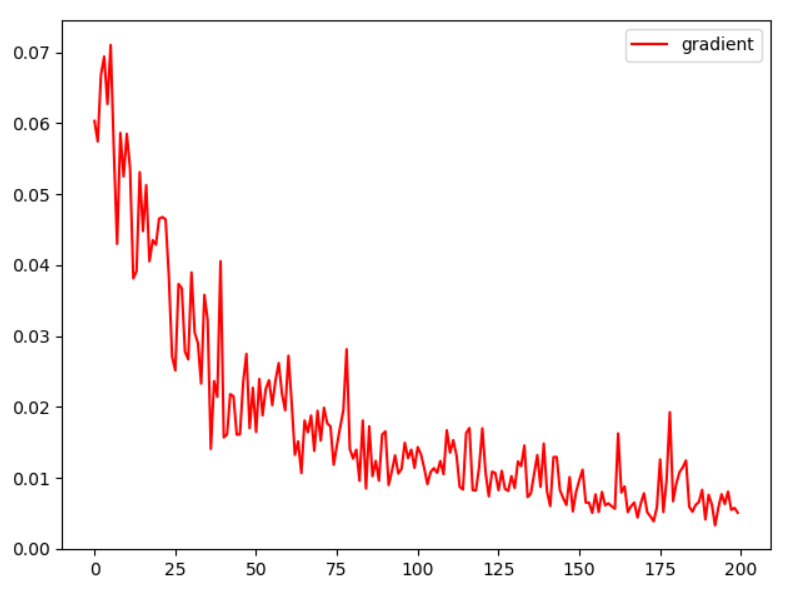

  **Графики преобразования на базисных фунцкциях:**
  
  
  
  
  
  
  
  
  
  
  
  
  **График преобразования генератором шума до обучения (размерности 8):**
  
  
  
 
 **Cходимость дискриминатора (генератор фиксирован):**
* Вывод:
* 0m 1s (0 45%) 1.3860585106
* 0m 2s (0 95%) 1.2752637272
* 0m 4s (1 45%) 1.2533146035
* 0m 4s (1 95%) 1.1387831208
* 0m 6s (2 45%) 1.0080166229
* 0m 6s (2 95%) 0.7262603302
* 0m 8s (3 45%) 0.5963395864
* 0m 9s (3 95%) 0.6801686285
* 0m 11s (4 45%) 0.3549261705
* 0m 11s (4 95%) 0.2575973772
* 0m 14s (5 45%) 0.2613432416
* 0m 14s (5 95%) 0.4485146386
* 0m 16s (6 45%) 0.2225984450
* 0m 16s (6 95%) 0.2104366320
* 0m 18s (7 45%) 0.1280114772
* 0m 18s (7 95%) 0.1763690174
* 0m 21s (8 45%) 0.1013842207
* 0m 21s (8 95%) 0.0759565001
* 0m 24s (9 45%) 0.1052490930
* 0m 24s (9 95%) 0.6381235720

* _chance of real data to be taken as real:  tensor([[0.4890], [0.9972], [0.9753],
 [0.9960],[0.9660]], dtype=torch.float64, grad_fn=<SigmoidBackward>)_

* _chance of fake data to be taken as real (before training gen):  tensor([[0.0411],[0.0446],[0.0391],
[0.0696],[0.0382]], dtype=torch.float64, grad_fn=<SigmoidBackward>)_

**Feature matching:**

**Сходимости генератора:**
**ВЕСА, КОТОРЫЕ НАДО ВОССТАНОВИТЬ:**
**[[0.7, 0.9], [0.1, 0.6]]**

* _random generator's weights:  tensor([[0.4486, 0.3011],[0.5370, 0.7040]], requires_grad=True)_
* 0m 2s (0 56%) 0.0154224870
* 0m 6s (1 56%) 0.0110635244
* 0m 9s (2 56%) 0.0078415594
* 0m 11s (3 56%) 0.0050585328
* 0m 14s (4 56%) 0.0037963286
* 0m 17s (5 56%) 0.0032420520
* 0m 20s (6 56%) 0.0024717097
* 0m 22s (7 56%) 0.0016101479
* 0m 25s (8 56%) 0.0019317505
* 0m 28s (9 56%) 0.0013948662
* 0m 30s (10 56%) 0.0005598741
* 0m 33s (11 56%) 0.0011541817
* 0m 36s (12 56%) 0.0008308046
* 0m 39s (13 56%) 0.0009026022
* 0m 41s (14 56%) 0.0004461783
* 0m 45s (15 56%) 0.0003485706
* 0m 48s (16 56%) 0.0002562926
* 0m 51s (17 56%) 0.0003733794
* 0m 54s (18 56%) 0.0003480133
* 0m 56s (19 56%) 0.0002374791
* 0m 59s (20 56%) 0.0001036045
* 1m 2s (21 56%) 0.0000914160
* 1m 6s (22 56%) 0.0001527083
* 1m 9s (23 56%) 0.0001004501
* 1m 12s (24 56%) 0.0000739314
* 1m 15s (25 56%) 0.0000460042
* 1m 18s (26 56%) 0.0000690680
* 1m 20s (27 56%) 0.0000396848
* 1m 23s (28 56%) 0.0000629261
* 1m 25s (29 56%) 0.0000320770
* 1m 28s (30 56%) 0.0000183109
* 1m 30s (31 56%) 0.0000447432
* 1m 33s (32 56%) 0.0000534669
* 1m 36s (33 56%) 0.0000410237
* 1m 38s (34 56%) 0.0000203598
* 1m 41s (35 56%) 0.0000362916
* 1m 44s (36 56%) 0.0000089167
* 1m 47s (37 56%) 0.0000177485
* 1m 49s (38 56%) 0.0000121865
* 1m 52s (39 56%) 0.0000184762
* 1m 55s (40 56%) 0.0000123906
* 1m 58s (41 56%) 0.0000324051
* 2m 0s (42 56%) 0.0000103881
* 2m 3s (43 56%) 0.0000145823
* 2m 6s (44 56%) 0.0000063428
* 2m 8s (45 56%) 0.0000124460
* 2m 11s (46 56%) 0.0000071720
* 2m 14s (47 56%) 0.0000122516
* 2m 17s (48 56%) 0.0000100133
* 2m 20s (49 56%) 0.0000047243
* _trained generator's weights:  tensor([[0.7452, 0.8513],[0.0876, 0.6137]], requires_grad=True)_
* _Веса почти восстанавливаются !_

**График сходимости:**

**Градиент:**

**Вывод генератора до обучения vs Вывод генератора после обучения vs Вывод идеального генератора:**

**Параллельное обучение:**
* НЕСКОЛЬКО РАЗНЫХ ВАРИАНТОВ (просто разные запуски)
* Вариант №1 (для себя №9) 
* _random weights for gen:  tensor([[0.9643, 0.8168],[0.8307, 0.9562]], requires_grad=True)_
* 0m 4s (0 62%) 0.1357209850   1.805254
* 0m 10s (1 62%) 0.0196666862   2.443082
* 0m 15s (2 62%) 0.0042221142   2.642356
* 0m 21s (3 62%) 0.0040567689   2.198193
* 0m 26s (4 62%) 0.0062836431   2.397281
* 0m 32s (5 62%) 0.0020262992   2.507017
* 0m 37s (6 62%) 0.0017957894   2.719903
* 0m 42s (7 62%) 0.0008045572   2.479197
* 0m 47s (8 62%) 0.0035590461   2.225221
* 0m 53s (9 62%) 0.0021098596   1.920095
* 0m 58s (10 62%) 0.0040052134   1.781886
* 1m 4s (11 62%) 0.0115491963   1.784812
* 1m 9s (12 62%) 0.0003023409   2.262406
* 1m 14s (13 62%) 0.0033685842   1.808263
* 1m 20s (14 62%) 0.0160331173   1.719081
* 1m 26s (15 62%) 0.0015269327   1.369595
* 1m 31s (16 62%) 0.1354136978   1.689723
* 1m 37s (17 62%) 0.3594087949   1.129355
* 1m 43s (18 62%) 0.2534908149   1.017426
* 1m 49s (19 62%) 1.5543625802   0.591811
* 1m 56s (20 62%) 0.6138733685   0.670373
* 2m 2s (21 62%) 0.4066434226   0.273485
* 2m 7s (22 62%) 0.8111412507   0.607213
* 2m 13s (23 62%) 1.8074547253   0.236453
* 2m 19s (24 62%) 1.1166711126   0.514510
* 2m 25s (25 62%) 1.4713830040   0.174264
* 2m 31s (26 62%) 0.8665732609   0.252253
* 2m 37s (27 62%) 0.9440736526   0.134964
* 2m 42s (28 62%) 1.5515318985   0.098558
* 2m 48s (29 62%) 1.2405416337   0.118983
* 2m 54s (30 62%) 1.5013149673   0.092295
* 3m 0s (31 62%) 1.5488171315   0.055244
* 3m 5s (32 62%) 1.2487724289   0.066169
* 3m 11s (33 62%) 1.3350220439   0.062337
* 3m 17s (34 62%) 1.1756883437   0.070458
* 3m 23s (35 62%) 1.4128381153   0.094021
* 3m 29s (36 62%) 1.4013434007   0.050710
* 3m 34s (37 62%) 1.3784536664   0.043293
* 3m 40s (38 62%) 1.3894848276   0.073023
* 3m 46s (39 62%) 1.3414341992   0.027488
* 3m 52s (40 62%) 1.3230380550   0.051590
* 3m 58s (41 62%) 1.3283844939   0.029761
* 4m 4s (42 62%) 1.4478401152   0.015093
* 4m 10s (43 62%) 1.2969873953   0.039381
* 4m 15s (44 62%) 1.3398086160   0.018149
* 4m 21s (45 62%) 1.4851575485   0.009272
* 4m 26s (46 62%) 1.3054511323   0.016548
* 4m 32s (47 62%) 1.2709392954   0.024746
* 4m 37s (48 62%) 1.4026093046   0.031998
* 4m 43s (49 62%) 1.3623182872   0.018302
* 4m 48s (50 62%) 1.4588429947   0.040473
* 4m 54s (51 62%) 1.3793106264   0.030553
* 5m 0s (52 62%) 1.3277453878   0.032683
* 5m 5s (53 62%) 1.4269612149   0.015535
* 5m 11s (54 62%) 1.4292574645   0.012968
* 5m 16s (55 62%) 1.5416969606   0.018223
* 5m 22s (56 62%) 1.2791953466   0.011295
* 5m 27s (57 62%) 1.3870289093   0.014322
* 5m 32s (58 62%) 1.4212976714   0.010083
* 5m 38s (59 62%) 1.4174510795   0.035582
* _chance of real data to be taken as real:  tensor(0.5116, dtype=torch.float64, grad_fn=<MeanBackward1>)_
* _chance of fake data to be taken as real:  tensor(0.5102, dtype=torch.float64, grad_fn=<MeanBackward1>)_
* _trained generator's weights:  tensor([[0.9043, 0.7015],[0.2623, 0.4434]], requires_grad=True)_
TEST
* _chance that fake is taken for real:  tensor(0.5065, dtype=torch.float64, grad_fn=<MeanBackward1>)_
* _chance that real is taken for real:  tensor(0.5004, dtype=torch.float64, grad_fn=<MeanBackward1>)_
* _chance that fake is taken for real:  tensor(0.4998, dtype=torch.float64, grad_fn=<MeanBackward1>)_
* _chance that real is taken for real:  tensor(0.4993, dtype=torch.float64, grad_fn=<MeanBackward1>)_
* _chance that fake is taken for real:  tensor(0.4924, dtype=torch.float64, grad_fn=<MeanBackward1>)_
* _chance that real is taken for real:  tensor(0.4935, dtype=torch.float64, grad_fn=<MeanBackward1>)_
* _chance that fake is taken for real:  tensor(0.5010, dtype=torch.float64, grad_fn=<MeanBackward1>)_
* _chance that real is taken for real:  tensor(0.5017, dtype=torch.float64, grad_fn=<MeanBackward1>)_
* _chance that fake is taken for real:  tensor(0.4940, dtype=torch.float64, grad_fn=<MeanBackward1>)_
* _chance that real is taken for real:  tensor(0.4962, dtype=torch.float64, grad_fn=<MeanBackward1>)_
* _chance that fake is taken for real:  tensor(0.5189, dtype=torch.float64, grad_fn=<MeanBackward1>)_
* _chance that real is taken for real:  tensor(0.5163, dtype=torch.float64, grad_fn=<MeanBackward1>)_
* _chance that fake is taken for real:  tensor(0.4957, dtype=torch.float64, grad_fn=<MeanBackward1>)_
* _chance that real is taken for real:  tensor(0.4974, dtype=torch.float64, grad_fn=<MeanBackward1>)_
* _chance that fake is taken for real:  tensor(0.4967, dtype=torch.float64, grad_fn=<MeanBackward1>)_
* _chance that real is taken for real:  tensor(0.5055, dtype=torch.float64, grad_fn=<MeanBackward1>)_
* _chance that fake is taken for real:  tensor(0.4820, dtype=torch.float64, grad_fn=<MeanBackward1>)_
* _chance that real is taken for real:  tensor(0.4826, dtype=torch.float64, grad_fn=<MeanBackward1>)_
* _chance that fake is taken for real:  tensor(0.4993, dtype=torch.float64, grad_fn=<MeanBackward1>)_
* _chance that real is taken for real:  tensor(0.5040, dtype=torch.float64, grad_fn=<MeanBackward1>)_

**График сходимости:**

**График градиента:**

**Вывод:**

* Вариант №2 (для себя №10)
* _random weights for gen:  tensor([[0.3345, 0.2073],[0.3464, 0.7186]], requires_grad=True)_
* 0m 5s (0 62%) 0.1310651578   2.046731
* 0m 11s (1 62%) 0.0042167974   2.940852
* 0m 17s (2 62%) 0.0028322412   2.832512
* 0m 22s (3 62%) 0.0274790118   2.827492
* 0m 27s (4 62%) 0.0058339981   2.721415
* 0m 32s (5 62%) 0.0160997291   2.623115
* 0m 37s (6 62%) 0.0024557710   2.303931
* 0m 42s (7 62%) 0.0057592904   1.634573
* 0m 47s (8 62%) 0.0529093301   2.321229
* 0m 53s (9 62%) 0.0024947768   1.946898
* 0m 58s (10 62%) 0.2837743716   1.654921
* 1m 3s (11 62%) 0.0389264201   1.347097
* 1m 8s (12 62%) 0.3670928957   1.230580
* 1m 13s (13 62%) 0.6989291975   0.812951
* 1m 19s (14 62%) 1.3502453967   0.676448
* 1m 24s (15 62%) 0.5743647697   0.372776
* 1m 30s (16 62%) 0.7971466440   0.443421
* 1m 35s (17 62%) 0.5936711231   0.492699
* 1m 41s (18 62%) 0.2267837003   0.587402
* 1m 46s (19 62%) 0.9340498707   0.664723
* 1m 51s (20 62%) 0.8683170405   0.305272
* 1m 57s (21 62%) 0.5064209434   0.421504
* 2m 2s (22 62%) 0.8942602191   0.429083
* 2m 7s (23 62%) 0.7377754656   0.260492
* 2m 12s (24 62%) 0.5871922648   0.267617
* 2m 17s (25 62%) 0.4601449702   0.195626
* 2m 22s (26 62%) 0.3013254629   0.444296
* 2m 27s (27 62%) 0.7396773295   0.305200
* 2m 32s (28 62%) 0.7193041120   0.303946
* 2m 37s (29 62%) 0.7460060176   0.452266
* 2m 42s (30 62%) 0.7147544006   0.368207
* 2m 48s (31 62%) 0.3788586456   0.195471
* 2m 52s (32 62%) 0.8997790023   0.511083
* 2m 58s (33 62%) 1.0805052645   0.125999
* 3m 3s (34 62%) 1.0235765157   0.098275
* 3m 7s (35 62%) 1.1447035451   0.313470
* 3m 13s (36 62%) 1.3152113650   0.178120
* 3m 18s (37 62%) 0.8941813933   0.275947
* 3m 23s (38 62%) 1.0557123362   0.226791
* 3m 28s (39 62%) 0.7214593330   0.149799
* 3m 33s (40 62%) 1.0440260494   0.322525
* 3m 39s (41 62%) 0.5672891786   0.285927
* 3m 44s (42 62%) 1.2350053084   0.078314
* 3m 49s (43 62%) 0.9924407747   0.133308
* 3m 54s (44 62%) 1.3075263210   0.168017
* 4m 0s (45 62%) 0.9131349334   0.145933
* 4m 5s (46 62%) 1.3152739195   0.135000
* 4m 11s (47 62%) 1.1578156263   0.126869
* 4m 16s (48 62%) 1.0559265230   0.085066
* 4m 21s (49 62%) 1.1182243339   0.094695
* 4m 28s (50 62%) 0.8290798335   0.135793
* 4m 34s (51 62%) 1.5220014745   0.107705
* 4m 39s (52 62%) 1.1495303634   0.077165
* 4m 45s (53 62%) 0.9654346801   0.066217
* 4m 51s (54 62%) 0.9053509060   0.066812
* 4m 56s (55 62%) 1.3506699871   0.076176
* 5m 2s (56 62%) 1.2903520419   0.063268
* 5m 8s (57 62%) 1.3506671246   0.089758
* 5m 14s (58 62%) 1.3098976156   0.114966
* 5m 19s (59 62%) 1.5568335736   0.034937
* _chance of real data to be taken as real:  tensor(0.6804, dtype=torch.float64, grad_fn=<MeanBackward1>)_
* _chance of fake data to be taken as real:  tensor(0.5442, dtype=torch.float64, grad_fn=<MeanBackward1>)_
* _trained generator's weights:  tensor([[0.7697, 0.6770],[0.1507, 0.5453]], requires_grad=True)_
* TEST
* _chance that fake is taken for real:  tensor(0.4419, dtype=torch.float64, grad_fn=<MeanBackward1>)_
* _chance that real is taken for real:  tensor(0.5837, dtype=torch.float64, grad_fn=<MeanBackward1>)_
* _chance that fake is taken for real:  tensor(0.5073, dtype=torch.float64, grad_fn=<MeanBackward1>)_
* _chance that real is taken for real:  tensor(0.6966, dtype=torch.float64, grad_fn=<MeanBackward1>)_
* _chance that fake is taken for real:  tensor(0.4311, dtype=torch.float64, grad_fn=<MeanBackward1>)_
* _chance that real is taken for real:  tensor(0.6312, dtype=torch.float64, grad_fn=<MeanBackward1>)_
* _chance that fake is taken for real:  tensor(0.4714, dtype=torch.float64, grad_fn=<MeanBackward1>)_
* _chance that real is taken for real:  tensor(0.6239, dtype=torch.float64, grad_fn=<MeanBackward1>)_
* _chance that fake is taken for real:  tensor(0.4832, dtype=torch.float64, grad_fn=<MeanBackward1>)_
* _chance that real is taken for real:  tensor(0.6301, dtype=torch.float64, grad_fn=<MeanBackward1>)_
* _chance that fake is taken for real:  tensor(0.5497, dtype=torch.float64, grad_fn=<MeanBackward1>)_
* _chance that real is taken for real:  tensor(0.7189, dtype=torch.float64, grad_fn=<MeanBackward1>)_
* _chance that fake is taken for real:  tensor(0.4176, dtype=torch.float64, grad_fn=<MeanBackward1>)_
* _chance that real is taken for real:  tensor(0.5949, dtype=torch.float64, grad_fn=<MeanBackward1>)_
* _chance that fake is taken for real:  tensor(0.3981, dtype=torch.float64, grad_fn=<MeanBackward1>)_
* _chance that real is taken for real:  tensor(0.6379, dtype=torch.float64, grad_fn=<MeanBackward1>)_
* _chance that fake is taken for real:  tensor(0.5041, dtype=torch.float64, grad_fn=<MeanBackward1>)_
* _chance that real is taken for real:  tensor(0.6874, dtype=torch.float64, grad_fn=<MeanBackward1>)_
* _chance that fake is taken for real:  tensor(0.5095, dtype=torch.float64, grad_fn=<MeanBackward1>)_
* _chance that real is taken for real:  tensor(0.6825, dtype=torch.float64, grad_fn=<MeanBackward1>)_

**График сходимости:**

**График градиента:**

**Вывод:**

* Вариант №3 (для себя №11) - не очень удачный, генератор не успевает достаточно обучиться
* _random weights for gen:  tensor([[0.2685, 0.3547],[0.8568, 0.2333]], requires_grad=True)_
* 0m 3s (0 62%) 0.2801649124   0.889693
* 0m 9s (1 62%) 0.0481443910   1.952643
* 0m 14s (2 62%) 0.0282223831   2.058037
* 0m 19s (3 62%) 0.0192516118   1.480182
* 0m 24s (4 62%) 0.0094993343   2.331137
* 0m 29s (5 62%) 0.0129286870   2.005165
* 0m 34s (6 62%) 0.0070858116   2.283519
* 0m 39s (7 62%) 0.0096976557   2.324603
* 0m 45s (8 62%) 0.0037774940   2.237056
* 0m 51s (9 62%) 0.0055991553   1.375202
* 0m 57s (10 62%) 0.0231894364   1.666508
* 1m 2s (11 62%) 0.0049642096   1.614447
* 1m 7s (12 62%) 0.0069592969   1.455327
* 1m 12s (13 62%) 0.0021291709   1.728242
* 1m 18s (14 62%) 0.0035033761   1.824856
* 1m 23s (15 62%) 0.0031812417   2.053896
* 1m 28s (16 62%) 0.2462390143   1.975605
* 1m 33s (17 62%) 0.0195808336   1.775785
* 1m 38s (18 62%) 0.0050814790   1.311594
* 1m 44s (19 62%) 0.0202062060   0.579059
* 1m 49s (20 62%) 0.0805043677   1.617865
* 1m 54s (21 62%) 0.2513960747   1.163311
* 2m 1s (22 62%) 0.2202615497   0.979389
* 2m 7s (23 62%) 0.0160645843   1.262658
* 2m 13s (24 62%) 0.4363393737   0.989166
* 2m 19s (25 62%) 0.1905477597   1.236719
* 2m 25s (26 62%) 0.0592503835   0.948390
* 2m 30s (27 62%) 0.2713099795   1.098238
* 2m 35s (28 62%) 0.8189267232   0.710518
* 2m 41s (29 62%) 1.4252543883   0.582259
* 2m 47s (30 62%) 0.0868233370   0.753713
* 2m 53s (31 62%) 0.2120134683   0.888060
* 3m 0s (32 62%) 0.9774909174   0.494315
* 3m 5s (33 62%) 1.0894925058   0.363714
* 3m 11s (34 62%) 0.4491114490   0.306955
* 3m 17s (35 62%) 0.9076786709   0.451879
* 3m 23s (36 62%) 0.5998887519   0.416194
* 3m 29s (37 62%) 0.4818402317   0.259142
* 3m 34s (38 62%) 1.3278004622   0.468679
* 3m 40s (39 62%) 0.8211567185   0.402161
* 3m 45s (40 62%) 0.3713725053   0.306157
* 3m 51s (41 62%) 1.0809388380   0.338170
* 3m 57s (42 62%) 0.6036286055   0.322883
* 4m 3s (43 62%) 1.6453194264   0.300100
* 4m 8s (44 62%) 1.0297699762   0.288810
* 4m 13s (45 62%) 1.0823160301   0.336996
* 4m 19s (46 62%) 0.3573008987   0.235693
* 4m 26s (47 62%) 0.7420829724   0.380336
* 4m 32s (48 62%) 0.5385352052   0.205857
* 4m 38s (49 62%) 0.5923270975   0.226818
* 4m 44s (50 62%) 0.9373729839   0.321793
* 4m 50s (51 62%) 1.0287763700   0.261049
* 4m 57s (52 62%) 1.0732097813   0.230732
* 5m 2s (53 62%) 1.0762919033   0.289210
* 5m 9s (54 62%) 0.9387203019   0.270563
* 5m 15s (55 62%) 0.9789617189   0.314223
* 5m 20s (56 62%) 1.1483831776   0.233608
* 5m 26s (57 62%) 1.0919176422   0.175138
* 5m 31s (58 62%) 1.1299957097   0.223114
* 5m 36s (59 62%) 1.0259687412   0.365407
* _chance of real data to be taken as real:  tensor(0.7717, dtype=torch.float64, grad_fn=<MeanBackward1>)_
* _chance of fake data to be taken as real:  tensor(0.5402, dtype=torch.float64, grad_fn=<MeanBackward1>)_
* _trained generator's weights:  tensor([[ 0.6501,  0.7490],[ 0.6022, -0.0151]], requires_grad=True)_
 
 **График сходимости:**

**График градиента:**

**Вывод:**

 * Вариант №4 (для себя №12)
* _random weights for gen:  tensor([[0.1044, 0.4716],[0.2130, 0.3697]], requires_grad=True)_
* 0m 9s (0 62%) 0.0239001066   4.276096
* 0m 22s (1 62%) 0.0049184582   5.243903
* 0m 35s (2 62%) 0.0013762016   4.687016
* 0m 55s (3 62%) 0.0006090927   4.641084
* 1m 8s (4 62%) 0.0003803517   5.312078
* 1m 21s (5 62%) 0.0003572162   4.680834
* 1m 33s (6 62%) 0.0002429941   3.822351
* 1m 45s (7 62%) 0.0001932398   3.644050
* 1m 57s (8 62%) 0.0001907230   3.228626
* 2m 10s (9 62%) 0.0001459141   3.143929
* 2m 23s (10 62%) 0.0001731467   2.695220
* 2m 37s (11 62%) 0.0002216578   2.382788
* 2m 51s (12 62%) 0.0003485266   2.057123
* 3m 4s (13 62%) 0.0004842365   1.702802
* 3m 20s (14 62%) 0.0006010416   1.658953
* 3m 33s (15 62%) 0.0043313325   1.298122
* 3m 52s (16 62%) 0.0330140378   1.486783
* 4m 7s (17 62%) 0.0487382908   1.110765
* 4m 23s (18 62%) 0.0015426182   0.879034
* 4m 39s (19 62%) 0.0178713337   0.883971
* 4m 52s (20 62%) 0.0219107747   0.865591
* 5m 9s (21 62%) 0.2981021049   0.798615
* 5m 24s (22 62%) 0.4633291455   0.370227
* 5m 44s (23 62%) 1.8937553124   0.779551
* 6m 31s (24 62%) 0.0689880698   0.454985
* 6m 45s (25 62%) 0.3363568143   0.494335
* 6m 59s (26 62%) 0.0590236151   0.652401
* 7m 12s (27 62%) 0.1030576540   0.567643
* 7m 27s (28 62%) 0.7986951995   0.375644
* 7m 56s (29 62%) 0.4197206151   0.353164
* 8m 9s (30 62%) 0.4168386983   0.113880
* 8m 23s (31 62%) 0.9540834881   0.224325
* 8m 36s (32 62%) 0.6268698613   0.160497
* 8m 48s (33 62%) 0.4606006035   0.213644
* 9m 0s (34 62%) 0.5533800705   0.118539
* 9m 12s (35 62%) 0.9333200565   0.224881
* 9m 25s (36 62%) 1.0433337803   0.151325
* 9m 37s (37 62%) 0.7075494293   0.150902
* 9m 49s (38 62%) 0.6620556607   0.162851
* 10m 1s (39 62%) 0.3672071037   0.133649
* 10m 13s (40 62%) 0.9858220006   0.110194
* 10m 25s (41 62%) 0.9037717259   0.143631
* 10m 37s (42 62%) 0.5632409922   0.082138
* 10m 50s (43 62%) 0.6082162012   0.105208
* 11m 2s (44 62%) 0.7211839315   0.068988
* 11m 15s (45 62%) 0.9866604512   0.098787
* 11m 27s (46 62%) 1.0385201973   0.120860
* 11m 40s (47 62%) 0.4636205733   0.142571
* 11m 52s (48 62%) 0.5353686859   0.059001
* 12m 6s (49 62%) 0.9264094812   0.103104
* 12m 19s (50 62%) 0.8163825543   0.074629
* 12m 32s (51 62%) 0.7689797743   0.090562
* 12m 44s (52 62%) 0.7950821981   0.097725
* 12m 56s (53 62%) 0.7069136899   0.091444
* 13m 9s (54 62%) 0.6582976864   0.056492
* 13m 21s (55 62%) 0.9520052777   0.090071
* 13m 34s (56 62%) 0.9636866458   0.053075
* 13m 46s (57 62%) 0.8022249527   0.059595
* 13m 58s (58 62%) 0.9929411301   0.047218
* 14m 10s (59 62%) 1.4150779634   0.045492
* _chance of real data to be taken as real:  tensor(0.6933, dtype=torch.float64, grad_fn=<MeanBackward1>)_
* _chance of fake data to be taken as real:  tensor(0.3933, dtype=torch.float64, grad_fn=<MeanBackward1>)_
* _trained generator's weights:  tensor([[0.5932, 0.9341],[0.1938, 0.5108]], requires_grad=True)_
* TEST
* _chance that fake is taken for real:  tensor(0.3025, dtype=torch.float64, grad_fn=<MeanBackward1>)_
* _chance that real is taken for real:  tensor(0.4981, dtype=torch.float64, grad_fn=<MeanBackward1>)_
* _chance that fake is taken for real:  tensor(0.4339, dtype=torch.float64, grad_fn=<MeanBackward1>)_
* _chance that real is taken for real:  tensor(0.7349, dtype=torch.float64, grad_fn=<MeanBackward1>)_
* _chance that fake is taken for real:  tensor(0.4142, dtype=torch.float64, grad_fn=<MeanBackward1>)_
* _chance that real is taken for real:  tensor(0.8843, dtype=torch.float64, grad_fn=<MeanBackward1>)_
* _chance that fake is taken for real:  tensor(0.1943, dtype=torch.float64, grad_fn=<MeanBackward1>)_
* _chance that real is taken for real:  tensor(0.5840, dtype=torch.float64, grad_fn=<MeanBackward1>)_
* _chance that fake is taken for real:  tensor(0.3318, dtype=torch.float64, grad_fn=<MeanBackward1>)_
* _chance that real is taken for real:  tensor(0.6212, dtype=torch.float64, grad_fn=<MeanBackward1>)_
* _chanSce that fake is taken for real:  tensor(0.2931, dtype=torch.float64, grad_fn=<MeanBackward1>)_
* _chance that real is taken for real:  tensor(0.6548, dtype=torch.float64, grad_fn=<MeanBackward1>)_
* _chance that fake is taken for real:  tensor(0.3389, dtype=torch.float64, grad_fn=<MeanBackward1>)_
* _chance that real is taken for real:  tensor(0.5986, dtype=torch.float64, grad_fn=<MeanBackward1>)_
* _chance that fake is taken for real:  tensor(0.3312, dtype=torch.float64, grad_fn=<MeanBackward1>)_
* _chance that real is taken for real:  tensor(0.5602, dtype=torch.float64, grad_fn=<MeanBackward1>)_
* _chance that fake is taken for real:  tensor(0.2495, dtype=torch.float64, grad_fn=<MeanBackward1>)_
* _chance that real is taken for real:  tensor(0.6658, dtype=torch.float64, grad_fn=<MeanBackward1>)_
* _chance that fake is taken for real:  tensor(0.3373, dtype=torch.float64, grad_fn=<MeanBackward1>)_
* _chance that real is taken for real:  tensor(0.6188, dtype=torch.float64, grad_fn=<MeanBackward1>)_

**График сходимости:**

**График градиента:**

**Вывод:**

**Результаты на реальных данных: ** 

Дискриминатор фиксирован, генератор обучается

**График сходимости:**

**График градиента:**

Параллельное обучение:
**График сходимости:**

* _chance of real data to be taken as real:  tensor(0.7571, dtype=torch.float64, grad_fn=<MeanBackward1>)_
* _chance of fake data to be taken as real:  tensor(0.3370, dtype=torch.float64, grad_fn=<MeanBackward1>)_
* _trained generator's weights:  tensor([[ 0.5405, -0.3171],[ 0.5441, -0.2890]], requires_grad=True)_
 
>lr_dis = 0.03, 
>lr_gen = 0.003, 
>epochs = 15, 
>k = 3 (dis updates per 1 gen update)

